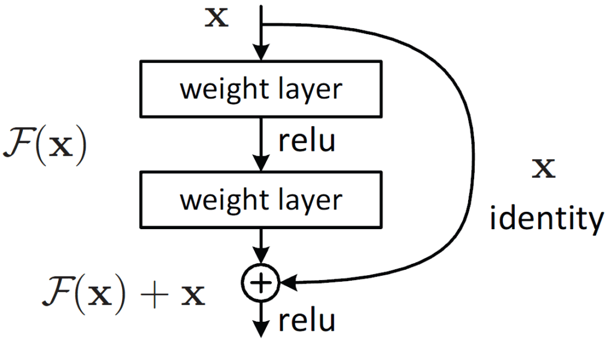
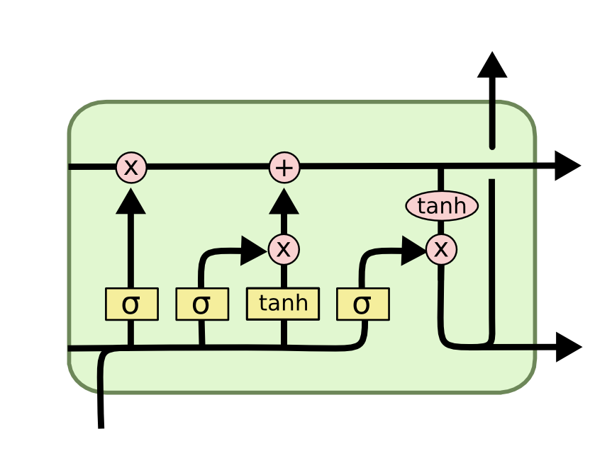
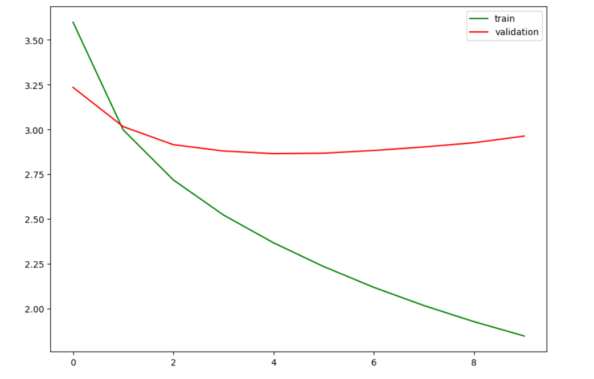
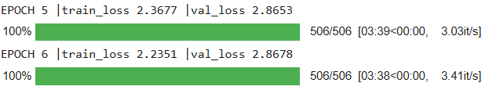
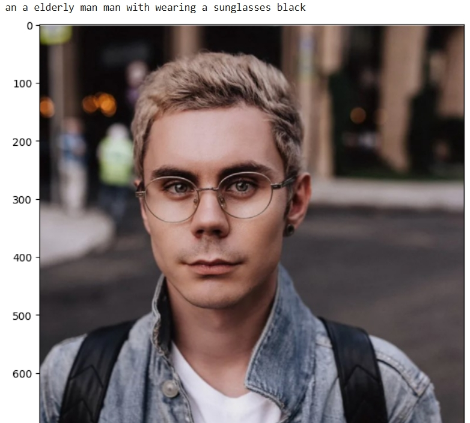
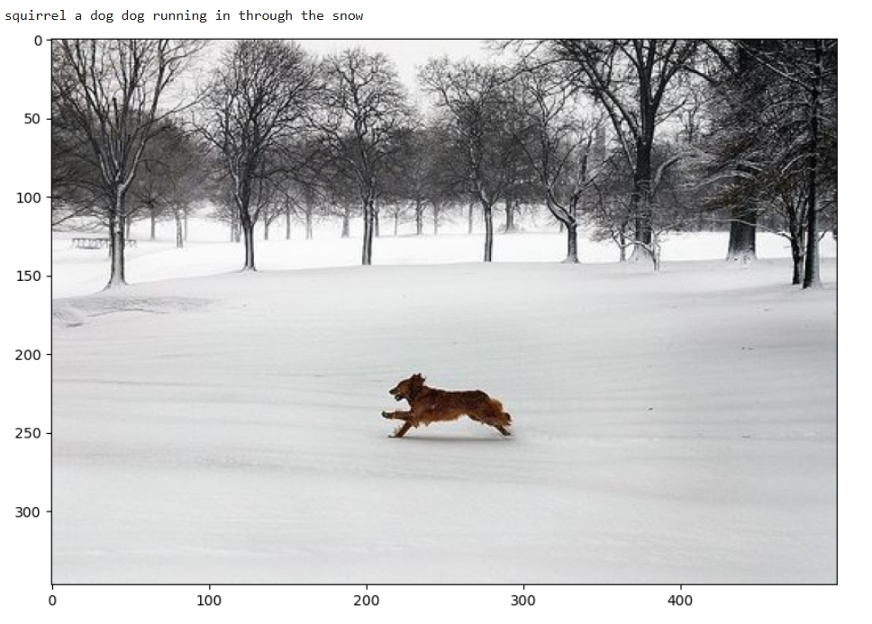
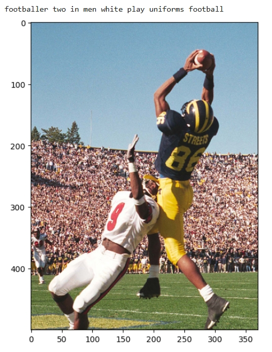
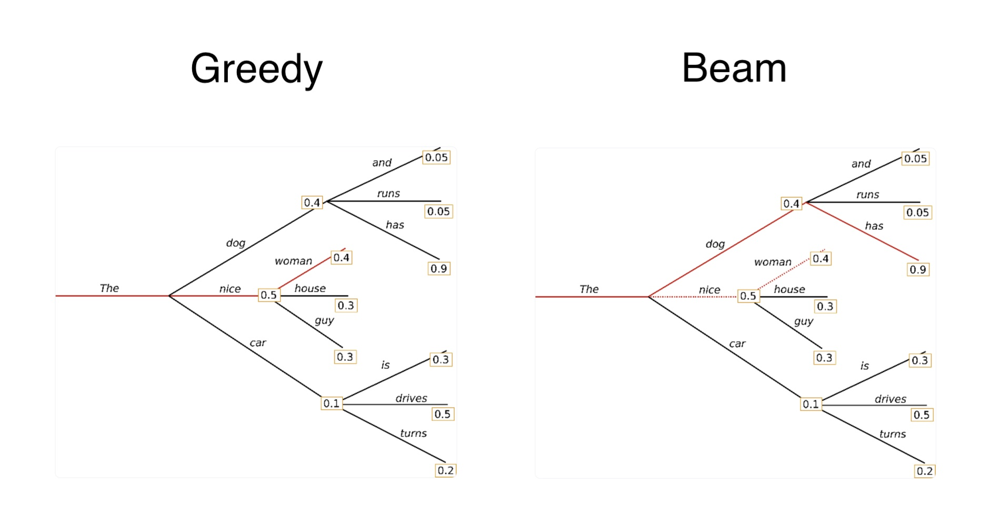

## О проекте
Мой проект посвящён задаче описания картинок (**Image Captioning**)
Идея состоит в том, чтобы по картинке сгенерировать её описание.

Задача показалась мне интересной, потому что она включает в себя как CV, так и NLP
Модель должна не только понять что на фотографии, но и связно описать его словами
В рамках проекта я реализовал полный pipeline обучения и валидации модели на небольшом датасете **Flickr8k**.
## Почему это актуально?
Image Captioning - это полезная задача, которая может применяться в разных сферах:
### Доступность для людей с нарушениями зрения
Изображения - важная часть нашего цифрового мира, и они остаются недоступными, если не содержат альтернативный текст. Подписи к изображениям помогают автоматически генерировать текстовые описания. Таким образом, вспомогательные технологии могут зачитывать их вслух, делая интернет доступным для всех.
### Социальные сети и маркетплейсы
Если человек загружает фотографию в социальной сети, то он может потратить время на то, чтобы выбрать к ней описание. Автоматическое описание изображений может помочь, предоставляя текстовое описание. 
Также на Iphone есть система которая автоматически помечает все фотографии каким-нибудь тегом вроде "Поездка в горы"
На некоторых сайтах/маркетплейсах при выставлении товара на продажу предлагается автоматическое описание по картинке с учётом свойств продукта.
### Поисковые системы
Благодаря автоматическим подписям к изображениям поисковая система сопоставляет текстовые запросы с описаниями каждой фотографии. Платформы вроде Google сохраняют такие подписи или альт‑текст как метаданные, что помогает находить изображения и улучшает их поисковую оптимизацию.
## Постановка задачи

Сначала модель извлекает высокоуровневые признаки изображения, а затем последовательно генерирует слово за словом.

Изображение подаётся на вход в **Encoder**, который извлекает признаки изображения. Далее через полносвязный слой формируется вектор фиксированного размера, совпадающий с размерностью эмбеддинга.
После этого эмбеддинг подаётся на вход в **Decoder**, который шаг за шагом жадно генерирует токены описания. Генерация продолжается до тех пор, пока не будет предсказан токен конца последовательности EOS.
## Архитектура модели

В проекте используется связка:  
**ResNet** в роли Encoder  
**LSTM** в роли Decoder
### Почему я выбрал ResNet и LSTM? 

В настоящее время существуют трансформеры, которые отлично справляются со многими разными задачами, но для их обучения обычно нужен большой объём данных и вычислительных ресурсов. 
Если у нас есть небольшой датасет, то **ResNet+LSTM** сочетание отлично нам подойдёт.

### ResNet

**ResNet** - это мощная свёрточная архитектура, которая хорошо умеет извлекать высокоуровневые признаки изображения. 

Особенность ResNet - это **skip-connection**, он позволяет :
- обучать более глубокие сети
- бороться с затуханием и взрывами градиентов.
- передавать полезную информацию в глубокие слои

То есть, ResNet отвечает за **понимание изображения.**
### LSTM

**LSTM (Long Short-Term Memory)** - это вид рекуррентной нейронной сети, которая была создана для работы с длинными последовательностями.

Обычные RNN плохо справляются с длинным контекстом, то есть они забывают информацию в начале последовательности.
Из-за этого им сложно строить длинные и осмысленные последовательности.

LSTM имеет внутренний **механизм памяти**, он выбирает:
- какую информацию сохранить
- какую удалить
- и какую передать дальше

Это помогает удерживать важный контекст, лучше понимать предложение.
Для генерации слова нужно помнить, что уже было сгенерировано ранее.

То есть, Decoder - отвечает за **генерацию описания картинки**.
## Этапы проекта

1. загрузка и подготовка данных датасета Flickr8k
2. предобработка изображений и текстовых описаний
3. создание словаря 
4. токенизация
5. создание датасета и загрузчиков
6. реализация нейронной сети
7. обучение модели
8. анализ графика обучения и валидации
9. оценка качества по метрике BLEU
10. генерация описаний для новых картинок
## Используемый стек технологий

- Язык Python
- Jupyter Notebook
- PyTorch
- Torchvision
- NumPy
- Pandas
- Matplotlib
- NLTK 
## Датасет

Для обучения я использовал датасет **Flickr8k**
Он содержит более 8000 картинок и для каждой есть несколько эталонных описаний.
Это хорошо, ведь в картинке много информации и она может описываться несколькими правильными способами.
## Метрики

В проекте я использовал следующие метрики и показатели:
**avg_loss** - среднее значение кросс-энтропии
**BLEU1** - метрика качества сгенерированного текста.

В задаче image captioning у одного изображения может быть несколько корректных описаний картинки. И все эти варианты описания могут быть правильными, поэтому мы сравниваем сгенерированное описание с нескольими верными описаниями.

Наилучший результат метрики:
**BLEU-1 = 0.62**
## Эксперименты
Для того, чтобы увеличить значение метрики и качество генерации текстового описания, я проводил эксперименты.
Я варьировал гиперпараметры:
- learning rate
- размер словаря с помощью freq_threshold
- число эпох обучения
- размер скрытых слоёв
- dropout
- weight_decay

Добавил регуляризацию в виде Dropout и пробовал использовать weight_decay. Это было нужно для того, чтобы уменьшить переобучение и сделать обучение более устойчивым.

Т.к у нас небольшой датасет, то модель будет склонна к переобучению, то есть loss на train будет уменьшаться, а на valid расти, медленно и уверенно.

По графику видно, что loss на train продолжает уменьшаться, а вот на valid после 5-й эпохи начинает постепенно расти. Это говорит о том, что модель всё лучше подстраивается под обучающую выборку, но её способность к обобщению начинает ухудшаться.

Также добавил сравнение **лучшей модели** и **модели** после 20 эпох
Лучшая модель имела лучшую обобщающую способность, а модель после 20 эпох на валидации не могла хорошо описать картинку, только картинки из самого датасета.

Ошибка на валидации растёт уже после 5-ой эпохи обучения, давайте разберемся с чем это может быть связано.
Это может быть связано по нескольким причинам:
- маленький размер датасета (~8000 картинок)
- простая архитектура
- ограниченность словаря
- склонность модели выдавать слишком общие записи
### Примеры
Метрики это хорошо, но важно и нужно визуально оценить качество модели.
Будем смотреть пример новых изображений и из датасета.

Модель отлично понимает, что изображено на картинке, даже может считать объекты, но чуть-чуть не может связать слова между собой.
Как видно, модель может генерировать несколько одинаковых слов друг за другом, но почему?
Всё зависит от варианта генерации текста, в моём случае использовался жадный алгоритм генерации (**greedy search**), то есть модель брала токен с наибольшей вероятностью.
Если использовать другие алгоритмы, например **beam search**, то модель будет строить некоторое дерево, и слова будут связаны между собой лучше.

## Возможные улучшения
Я считаю, что проект можно улучшать в разных направлениях.

- Например, начать с того, чтобы лучше подобрать learning_rate, а также добавить scheduler, чтобы обучение происходило быстрее. 

- Можно сделать интерфейс, чтобы загружать картинку и сразу получать её описание.

- Сделать архитектуру сложнее, но лучше, можно использовать механизм внимания attention.

- Обучать на более крупном датасете, тогда можно использовать архитектуру трансформера
## Вывод
Мне было интересно делать пет-проект и самостоятельно решать задачу Image Captioning, потому что иногда я сталкиваюсь с подобными системами в повседневной жизни.
В рамках проекта я прошёл все основные этапы построения такой системы.  

Для меня этот проект был полезен в понимании как строятся multimodal-системы, в которых изображение преобразуется в текст. Несмотря на простоту архитектуры, модель показала достойный результат и смогла научиться генерировать осмысленные описания изображений.
Проект можно улучшать, но уже в текущем виде он дал мне хороший практический опыт полного цикла работы над задачей image captioning, а также показал хороший результат по метрике BLEU1=0.62.